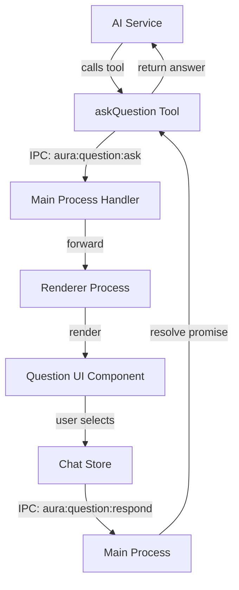

# Design Document: AI Question Tool

## Overview

The AI Question Tool enables the AI assistant to ask users multiple-choice questions (MCQ) during conversations with an optional custom answer field. The tool integrates with the existing Aura OS tools system, allowing the AI to pause execution, present interactive question UI in the chat, and receive the user's response to continue the conversation flow. This creates a bidirectional interaction pattern where the AI can gather specific information from users in a structured format.

## Architecture

The system follows Aura's existing IPC-based architecture with main process tool execution and renderer process UI presentation:



## Main Workflow Sequence

```mermaid
sequenceDiagram
    participant AI as AI Service
    participant Tool as askQuestion Tool
    participant Main as Main Process
    participant IPC as IPC Channel
    participant Renderer as Renderer Process
    participant UI as Question UI
    participant User as User

    AI->>Tool: execute({ question, options })
    Tool->>Main: create pending question
    Main->>IPC: send aura:question:ask
    IPC->>Renderer: forward question data
    Renderer->>UI: render MCQ component
    UI->>User: display options
    User->>UI: select option / enter custom
    UI->>Renderer: emit selection
    Renderer->>IPC: send aura:question:respond
    IPC->>Main: forward response
    Main->>Tool: resolve promise with answer
    Tool->>AI: return { answer, isCustom }


## Components and Interfaces

### Component 1: askQuestion Tool (Main Process)

**Purpose**: AI-callable tool that presents MCQ questions to users and waits for responses

**Interface**:
```javascript
{
  description: 'Ask the user a multiple-choice question with optional custom answer field',
  inputSchema: z.object({
    question: z.string().describe('The question to ask the user'),
    options: z.array(z.string()).min(2).describe('Array of choice options (minimum 2)'),
    allowCustom: z.boolean().optional().default(true).describe('Allow custom answer input'),
    customPlaceholder: z.string().optional().describe('Placeholder text for custom input field')
  }),
  execute: async ({ question, options, allowCustom, customPlaceholder }) => Promise<QuestionResponse>
}
```

**Responsibilities**:
- Register as an AI tool in the tools registry
- Create pending question state with unique ID
- Send question data to renderer via IPC
- Wait for user response via promise
- Return structured response to AI
- Handle timeout scenarios (optional)

### Component 2: Question Manager (Main Process)

**Purpose**: Manages pending questions and response routing

**Interface**:
```javascript
class QuestionManager {
  createQuestion(questionData): { id, promise }
  resolveQuestion(id, answer): void
  rejectQuestion(id, error): void
  getPendingQuestion(id): QuestionState | null
  clearQuestion(id): void
}
```

**Responsibilities**:
- Generate unique question IDs
- Store pending question promises
- Route responses to correct promise resolvers
- Clean up completed questions
- Handle multiple concurrent questions (if needed)

### Component 3: Question UI Component (Renderer)

**Purpose**: Renders interactive MCQ interface in chat

**Interface**:
```vue
<template>
  <QuestionCard
    :question="questionData.question"
    :options="questionData.options"
    :allowCustom="questionData.allowCustom"
    :customPlaceholder="questionData.customPlaceholder"
    @answer="handleAnswer"
  />
</template>
```

**Responsibilities**:
- Display question text prominently
- Render clickable option buttons
- Show custom input field if enabled
- Validate custom input
- Emit answer selection
- Disable UI after answer submitted
- Show visual feedback for selection

### Component 4: Chat Store Integration (Renderer)

**Purpose**: Manages question state in chat context

**Interface**:
```javascript
{
  // State
  pendingQuestion: ref(null),

  // Actions
  setPendingQuestion(questionData): void,
  answerQuestion(answer, isCustom): void,
  clearPendingQuestion(): void
}
```

**Responsibilities**:
- Store active question data
- Trigger IPC response when answered
- Clear question after submission
- Integrate with message history

## Data Models

### Model 1: QuestionData

```javascript
interface QuestionData {
  id: string              // Unique question identifier (UUID)
  question: string        // Question text to display
  options: string[]       // Array of choice options (min 2)
  allowCustom: boolean    // Whether custom input is allowed
  customPlaceholder?: string  // Optional placeholder for custom field
  timestamp: number       // Creation timestamp
}
```

**Validation Rules**:
- `id` must be unique UUID v4
- `question` must be non-empty string (max 500 chars)
- `options` must have at least 2 items, each non-empty (max 200 chars each)
- `allowCustom` defaults to true
- `customPlaceholder` max 100 chars if provided

### Model 2: QuestionResponse

```javascript
interface QuestionResponse {
  answer: string          // The selected or custom answer
  isCustom: boolean       // Whether answer was custom input
  selectedIndex?: number  // Index of selected option (if not custom)
  timestamp: number       // Response timestamp
}
```

**Validation Rules**:
- `answer` must be non-empty string
- `isCustom` must be boolean
- `selectedIndex` required if `isCustom` is false
- `selectedIndex` must be valid index in original options array

### Model 3: QuestionState (Internal)

```javascript
interface QuestionState {
  id: string
  data: QuestionData
  promise: Promise<QuestionResponse>
  resolve: (response: QuestionResponse) => void
  reject: (error: Error) => void
  createdAt: number
}
```

**Validation Rules**:
- All fields required
- `promise` must be pending (not resolved/rejected)
- `createdAt` must be valid timestamp

## Algorithmic Pseudocode

### Main Question Flow Algorithm

```pascal
ALGORITHM executeAskQuestion(questionParams)
INPUT: questionParams of type { question, options, allowCustom, customPlaceholder }
OUTPUT: response of type QuestionResponse

BEGIN
  ASSERT questionParams.question IS NOT EMPTY
  ASSERT questionParams.options.length >= 2

  // Step 1: Generate unique question ID
  questionId ← generateUUID()

  // Step 2: Create question data structure
  questionData ← {
    id: questionId,
    question: questionParams.question,
    options: questionParams.options,
    allowCustom: questionParams.allowCustom OR true,
    customPlaceholder: questionParams.customPlaceholder,
    timestamp: getCurrentTimestamp()
  }

  // Step 3: Create pending promise
  pendingPromise ← createPromise()

  // Step 4: Store in question manager
  questionManager.register(questionId, questionData, pendingPromise)

  // Step 5: Send to renderer via IPC
  ipcSend('aura:question:ask', questionData)

  // Step 6: Wait for user response (blocks AI execution)
  TRY
    response ← AWAIT pendingPromise WITH TIMEOUT 300000  // 5 min timeout

    ASSERT response.answer IS NOT EMPTY
    ASSERT response.isCustom IS BOOLEAN

    // Step 7: Clean up
    questionManager.clear(questionId)

    RETURN response
  CATCH TimeoutError
    questionManager.clear(questionId)
    RETURN { answer: "timeout", isCustom: false, timestamp: getCurrentTimestamp() }
  CATCH error
    questionManager.clear(questionId)
    THROW error
  END TRY
END
```

**Preconditions**:
- `questionParams.question` is non-empty string
- `questionParams.options` is array with at least 2 elements
- IPC channel is available and connected
- Renderer process is ready

**Postconditions**:
- Returns valid QuestionResponse object
- Question state is cleaned up from manager
- User has seen and responded to question
- AI execution resumes with answer

**Loop Invariants**: N/A (no loops in main flow)

### Response Handling Algorithm

```pascal
ALGORITHM handleQuestionResponse(responseData)
INPUT: responseData of type { questionId, answer, isCustom, selectedIndex }
OUTPUT: void (resolves pending promise)

BEGIN
  ASSERT responseData.questionId IS NOT EMPTY
  ASSERT responseData.answer IS NOT EMPTY

  // Step 1: Find pending question
  questionState ← questionManager.getPendingQuestion(responseData.questionId)

  IF questionState IS NULL THEN
    LOG_WARNING("No pending question found for ID: " + responseData.questionId)
    RETURN
  END IF

  // Step 2: Validate response against original question
  IF responseData.isCustom = false THEN
    ASSERT responseData.selectedIndex IS DEFINED
    ASSERT responseData.selectedIndex >= 0
    ASSERT responseData.selectedIndex < questionState.data.options.length

    // Verify answer matches selected option
    expectedAnswer ← questionState.data.options[responseData.selectedIndex]
    ASSERT responseData.answer = expectedAnswer
  ELSE
    // Custom answer - verify custom was allowed
    ASSERT questionState.data.allowCustom = true
  END IF

  // Step 3: Create response object
  response ← {
    answer: responseData.answer,
    isCustom: responseData.isCustom,
    selectedIndex: responseData.selectedIndex,
    timestamp: getCurrentTimestamp()
  }

  // Step 4: Resolve the pending promise
  questionState.resolve(response)

  LOG_INFO("Question " + responseData.questionId + " answered: " + responseData.answer)
END
```

**Preconditions**:
- `responseData.questionId` exists in question manager
- `responseData.answer` is non-empty
- If not custom, `selectedIndex` is valid
- Question promise is still pending (not timed out)

**Postconditions**:
- Pending promise is resolved with response
- Question remains in manager (cleaned by execute function)
- Response data is validated and consistent

**Loop Invariants**: N/A

### UI Rendering Algorithm

```pascal
ALGORITHM renderQuestionUI(questionData)
INPUT: questionData of type QuestionData
OUTPUT: void (renders UI, waits for user interaction)

BEGIN
  ASSERT questionData.question IS NOT EMPTY
  ASSERT questionData.options.length >= 2

  // Step 1: Initialize UI state
  selectedOption ← NULL
  customInput ← ""
  isAnswered ← false

  // Step 2: Render question card
  DISPLAY questionData.question AS HEADING

  // Step 3: Render option buttons
  FOR each option IN questionData.options WITH INDEX i DO
    RENDER_BUTTON(
      text: option,
      onClick: () => handleOptionClick(i, option),
      disabled: isAnswered
    )
  END FOR

  // Step 4: Render custom input if allowed
  IF questionData.allowCustom = true THEN
    RENDER_INPUT_FIELD(
      placeholder: questionData.customPlaceholder OR "Enter your answer...",
      value: customInput,
      onChange: (value) => customInput ← value,
      disabled: isAnswered
    )

    RENDER_BUTTON(
      text: "Submit Custom Answer",
      onClick: () => handleCustomSubmit(customInput),
      disabled: isAnswered OR customInput.trim() = "",
      variant: "secondary"
    )
  END IF

  // Step 5: Wait for user interaction (event-driven)
  // UI remains interactive until answer submitted
END

PROCEDURE handleOptionClick(index, optionText)
BEGIN
  IF isAnswered = true THEN RETURN END IF

  selectedOption ← index
  isAnswered ← true

  // Visual feedback
  HIGHLIGHT_BUTTON(index)
  DISABLE_ALL_BUTTONS()

  // Send response
  EMIT_EVENT('answer', {
    questionId: questionData.id,
    answer: optionText,
    isCustom: false,
    selectedIndex: index
  })
END PROCEDURE

PROCEDURE handleCustomSubmit(customText)
BEGIN
  IF isAnswered = true THEN RETURN END IF
  IF customText.trim() = "" THEN RETURN END IF

  isAnswered ← true

  // Visual feedback
  DISABLE_ALL_BUTTONS()
  DISABLE_INPUT_FIELD()

  // Send response
  EMIT_EVENT('answer', {
    questionId: questionData.id,
    answer: customText.trim(),
    isCustom: true,
    selectedIndex: undefined
  })
END PROCEDURE
```

**Preconditions**:
- `questionData` is valid QuestionData object
- Vue component is mounted and reactive
- Event handlers are properly bound

**Postconditions**:
- UI is rendered with all options visible
- User can interact with buttons/input
- After answer, UI is disabled
- Answer event is emitted exactly once

**Loop Invariants**:
- During option rendering loop: All previously rendered buttons are functional
- Button indices match option array indices

## Key Functions with Formal Specifications

### Function 1: createQuestion()

```javascript
function createQuestion(questionData) {
  // Returns: { id, promise }
}
```

**Preconditions:**
- `questionData` is non-null object
-


**Preconditions:**
- `id` is valid UUID string
- `id` exists in pending questions map
- `answer` is valid QuestionResponse object
- Associated promise is still pending (not resolved/rejected)

**Postconditions:**
- Promise associated with `id` is resolved with `answer`
- Question state remains in map (caller responsible for cleanup)
- No errors thrown

**Loop Invariants:** N/A

### Function 3: validateQuestionParams()

```javascript
function validateQuestionParams(params) {
  // Returns: { valid: boolean, errors: string[] }
}
```

**Preconditions:**
- `params` is defined object (may be invalid)

**Postconditions:**
- Returns valid
],
  allowCustom: true
})

console.log(response)
// { answer: "JavaScript", isCustom: false, selectedIndex: 0, timestamp: 1234567890 }

// Example 2: Yes/No question without custom option
const confirmation = await askQuestion({
  question: "Do you want to proceed with this action?",
  options: ["Yes", "No"],
  allowCustom: false
})

// Example 3: Question with custom placeholder
const feedback = await askQuestion({
  question: "How would you rate this feature?",
  options: ["Excellent", "Good", "Fair", "Poor"],
  allowCustom: true,
  customPlaceholder: "Or describe your experience..."
})

// Example 4: AI using the tool in conversation
// AI Service automatically calls tool during streaming
// User sees interactive question UI in chat
// AI receives response and continues conversation
```

## Correctness Properties

### Property 1: Question Uniqueness
```javascript
// For all questions q1, q2 created by createQuestion():
// q1.id !== q2.id
// Ensures no ID collisions in question manager
```

### Property 2: Response Consistency
```javascript
// For all responses r where r.isCustom === false:
// r.selectedIndex must be valid index in original options array
// r.answer === originalQuestion.options[r.selectedIndex]
// Ensures selected answers match displayed options
```

### Property 3: Single Answer Guarantee
```javascript
// For all questions q:
// q.promise resolves exactly once
// After resolution, UI is disabled
// Subsequent answer attempts are ignored
// Ensures user cannot submit multiple answers
```

### Property 4: Timeout Safety
```javascript
// For all questions q with timeout T:
// If no response within T milliseconds:
//   q.promise resolves with timeout response
//   Question is cleaned from manager
// Ensures AI doesn't hang indefinitely
```

### Property 5: Custom Answer Validation
```javascript
// For all responses r where r.isCustom === true:
// originalQuestion.allowCustom === true
// r.answer.trim().length > 0
// Ensures custom answers only when allowed and non-empty
```

## Error Handling

### Error Scenario 1: IPC Channel Unavailable

**Condition**: Renderer process not ready or IPC channel disconnected
**Response**: Tool execution throws error immediately, AI receives error message
**Recovery**: AI can retry or inform user of technical issue

### Error Scenario 2: Invalid Question Parameters

**Condition**: Question text empty, options array has < 2 items, or invalid types
**Response**: Zod validation fails, tool execution throws validation error
**Recovery**: AI receives error and can reformulate question with valid parameters

### Error Scenario 3: User Timeout

**Condition**: User doesn't respond within timeout period (default 5 minutes)
**Response**: Promise resolves with timeout response `{ answer: "timeout", isCustom: false }`
**Recovery**: AI can acknowledge timeout and continue conversation or rephrase question

### Error Scenario 4: Question Manager State Corruption

**Condition**: Response received for non-existent question ID
**Response**: Log warning, ignore response, no promise resolution
**Recovery**: Graceful degradation - no crash, question may timeout naturally

### Error Scenario 5: Custom Answer When Disabled

**Condition**: User attempts custom answer when `allowCustom` is false
**Response**: UI prevents submission (button disabled), validation fails if bypassed
**Recovery**: User must select from provided options

## Testing Strategy

### Unit Testing Approach

Test each component in isolation with mocked dependencies:

**Question Manager Tests**:
- Test question creation generates unique IDs
- Test promise resolution/rejection
- Test concurrent question handling
- Test cleanup after resolution
- Test timeout scenarios

**Tool Execution Tests*
N questions, verify all IDs are unique
fc.assert(
  fc.property(fc.arra
string(), {minLength: 2, maxLength: 10}) }),
    fc.nat(),
    (questionData, index) => {
      fc.pre(index < questionData.options.length)
      const response = { answer: questionData.options[index], isCustom: false, selectedIndex: index }
      return validateResponse(response, questionData).valid === true
    }
  )
)
```

### Integration Testing Approach

Test full flow from AI tool call to user response:

1. **End-to-End Question Flow**: Mock AI service calls tool → verify IPC message sent → simulate user response → verify promise resolves correctly
2. **Chat Integration**: Test question appears in chat history, UI renders correctly, answer updates chat state
3. **Multiple Questions**: Test sequential questions work correctly, state doesn't leak between questions
4. **Error Scenarios**: Test IPC failures, timeouts, invalid responses are handled gracefully

## Performance Considerations

- **Question State Memory**: Limit concurrent pending questions to prevent memory leaks (max 10 concurrent)
- **Timeout Cleanup**: Implement automatic cleanup of timed-out questions to free resources
- **UI Rendering**: Use Vue's reactive system efficiently, avoid unnecessary re-renders
- **IPC Overhead**: Question data is small (<1KB typically), minimal serialization cost
- **Promise Management**: Use WeakMap for question state if possible to allow garbage collection

## Security Considerations

- **Input Sanitization**: Sanitize question text and options before rendering to prevent XSS
- **Answer Validation**: Validate all responses server-side (main process) before resolving promises
- **Rate Limiting**: Limit question frequency to prevent AI from spamming user (max 1 question per 5 seconds)
- **Custom Answer Length**: Enforce maximum length on custom answers (1000 chars) to prevent abuse
- **IPC Security**: Validate all IPC messages, ensure questionId cannot be spoofed

## Dependencies

- **ai** (v3.x): AI SDK for tool definition and execution
- **zod** (v3.x): Schema validation for tool parameters
- **electron**: IPC communication between main and renderer
- **vue** (v3.x): Reactive UI components
- **pinia**: State management for question state
- **uuid** (v9.x): Generate unique question IDs
- **lucide-vue-next**: Icons for UI components (optional)
