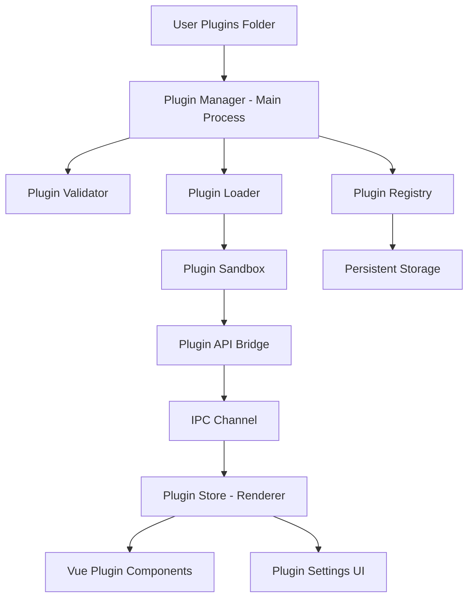
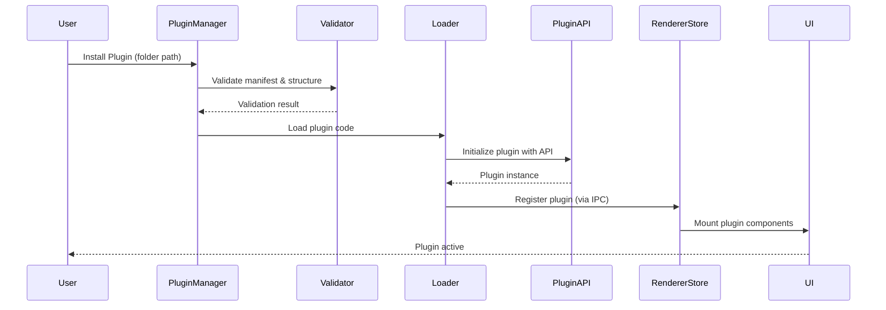
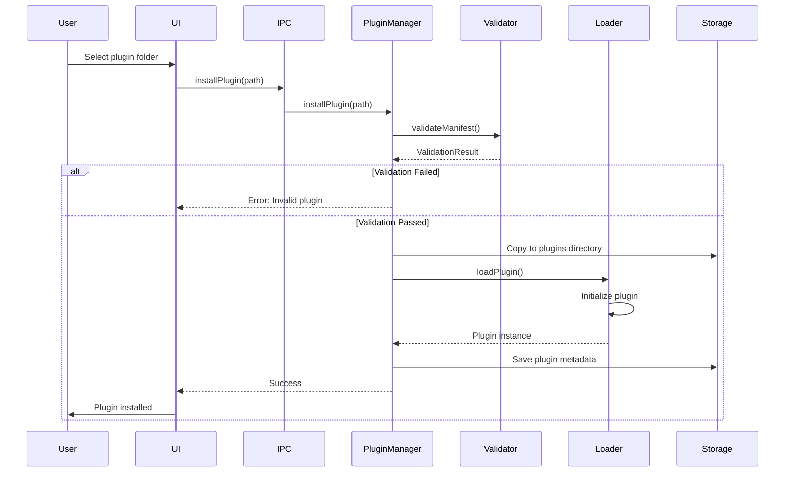

# Design Document: Plugin System

## Overview

The plugin system enables users to extend Aura's functionality by installing third-party plugins from local folders. Each plugin is a self-contained directory with a manifest file, assets, and code that integrates with Aura's existing architecture through a well-defined API. Plugins can add new UI components, register custom tools for the AI, contribute settings panels, and hook into application lifecycle events.

## Architecture

The plugin system follows Electron's process architecture with components in both the main process (Node.js) and renderer process (Vue 3). Plugins are discovered and loaded at application startup, with their capabilities exposed through a secure API bridge.



## Main Workflow



## Components and Interfaces

### Component 1: Plugin Manager (Main Process)

**Purpose**: Orchestrates plugin discovery, validation, loading, and lifecycle management

**Interface**:
```typescript
interface PluginManager {
  // Core operations
  installPlugin(pluginPath: string): Promise<InstallResult>
  uninstallPlugin(pluginId: string): Promise<boolean>
  enablePlugin(pluginId: string): Promise<boolean>
  disablePlugin(pluginId: string): Promise<boolean>

  // Discovery and queries
  discoverPlugins(): Promise<PluginMetadata[]>
  getInstalledPlugins(): PluginMetadata[]
  getPluginById(pluginId: string): Plugin | null

  // Lifecycle
  initializePlugins(): Promise<void>
  shutdownPlugins(): Promise<void>
}
```

**Responsibilities**:
- Scan user plugins directory for valid plugin folders
- Validate plugin manifests and structure
- Coordinate plugin loading and initialization
- Maintain plugin registry with enabled/disabled states
- Handle plugin installation and uninstallation
- Persist plugin configuration

### Component 2: Plugin Validator

**Purpose**: Ensures plugins meet security and structural requirements before loading

**Interface**:
```typescript
interface PluginValidator {
  validateManifest(manifest: unknown): ValidationResult
  validateStructure(pluginPath: string): ValidationResult
  validatePermissions(manifest: PluginManifest): ValidationResult
  validateDependencies(manifest: PluginManifest): ValidationResult
}

interface ValidationResult {
  valid: boolean
  errors: ValidationError[]
  warnings: ValidationWarning[]
}
```

**Responsibilities**:
- Verify manifest.json schema compliance
- Check required files and folder structure
- Validate requested permissions against allowed set
- Verify plugin ID uniqueness
- Check version compatibility with Aura
- Validate entry point files exist

### Component 3: Plugin Loader

**Purpose**: Dynamically loads plugin code and creates isolated execution contexts

**Interface**:
```typescript
interface PluginLoader {
  loadPlugin(pluginPath: string, manifest: PluginManifest): Promise<Plugin>
  unloadPlugin(pluginId: string): Promise<void>
  reloadPlugin(pluginId: string): Promise<void>
}
```

**Responsibilities**:
- Dynamically require/import plugin entry points
- Create isolated execution context for each plugin
- Inject Plugin API into plugin context
- Handle plugin initialization and activation
- Manage plugin lifecycle hooks
- Clean up resources on unload

### Component 4: Plugin API Bridge

**Purpose**: Provides secure, controlled access to Aura's capabilities for plugins

**Interface**:
```typescript
interface PluginAPI {
  // Core info
  getPluginInfo(): PluginInfo

  // UI extensions
  registerComponent(component: ComponentDefinition): void
  registerSettingsPanel(panel: SettingsPanelDefinition): void
  registerSidebarItem(item: SidebarItemDefinition): void

  // AI integration
  registerTool(tool: ToolDefinition): void
  onChatMessage(callback: (message: ChatMessage) => void): void
  sendChatMessage(message: string): void

  // Storage
  storage: {
    get(key: string): Promise<any>
    set(key: string, value: any): Promise<void>
    delete(key: string): Promise<void>
  }

  // Events
  on(event: string, callback: Function): void
  emit(event: string, data: any): void

  // Settings
  getSettings(): Promise<PluginSettings>
  updateSettings(settings: Partial<PluginSettings>): Promise<void>

  // Notifications
  showNotification(options: NotificationOptions): void
}
```

**Responsibilities**:
- Expose safe subset of Aura functionality
- Enforce permission checks for sensitive operations
- Provide isolated storage per plugin
- Enable inter-plugin communication via events
- Proxy IPC calls between main and renderer
- Log plugin API usage for debugging

### Component 5: Plugin Store (Renderer - Pinia)

**Purpose**: Manages plugin state in the Vue application

**Interface**:
```typescript
interface PluginStore {
  // State
  plugins: Map<string, PluginMetadata>
  activePlugins: Set<string>
  pluginComponents: Map<string, Component>

  // Actions
  registerPlugin(metadata: PluginMetadata): void
  unregisterPlugin(pluginId: string): void
  mountComponent(pluginId: string, component: Component): void
  unmountComponent(pluginId: string): void

  // Getters
  getPluginById(pluginId: string): PluginMetadata | undefined
  getActivePlugins(): PluginMetadata[]
  getPluginComponents(pluginId: string): Component[]
}
```

**Responsibilities**:
- Store plugin metadata in renderer process
- Track active/inactive plugin states
- Manage Vue component registration from plugins
- Provide reactive plugin data to UI
- Sync with main process plugin registry
- Handle plugin settings UI state

### Component 6: Plugin UI Integration

**Purpose**: Renders plugin-contributed UI components in appropriate locations

**Interface**:
```typescript
interface PluginUIIntegration {
  renderPluginComponents(location: UILocation): Component[]
  renderPluginSettings(pluginId: string): Component
  renderPluginSidebarItems(): SidebarItem[]
}

type UILocation = 'sidebar' | 'settings' | 'chat-toolbar' | 'main-panel'
```

**Responsibilities**:
- Dynamically mount plugin Vue components
- Provide plugin component slots in main UI
- Handle plugin component lifecycle
- Isolate plugin component styles
- Pass context data to plugin components

## Data Models

### Model 1: PluginManifest

```typescript
interface PluginManifest {
  // Identity
  id: string                    // Unique identifier (e.g., "com.example.weather")
  name: string                  // Display name
  version: string               // Semantic version (e.g., "1.0.0")
  description: string           // Short description
  author: string                // Author name

  // Compatibility
  auraVersion: string           // Compatible Aura version (e.g., "^1.0.0")

  // Entry points
  main: string                  // Main process entry (e.g., "./main.js")
  renderer?: string             // Renderer process entry (e.g., "./renderer.js")

  // Permissions
  permissions: Permission[]     // Requested permissions

  // UI contributions
  contributes?: {
    components?: ComponentContribution[]
    settings?: SettingsContribution
    sidebar?: SidebarContribution[]
    tools?: ToolContribution[]
  }

  // Dependencies
  dependencies?: Record<string, string>

  // Assets
  icon?: string                 // Path to plugin icon

  // Metadata
  homepage?: string
  repository?: string
  license?: string
}
```

**Validation Rules**:
- `id` must be unique, lowercase, dot-separated (e.g., "com.author.plugin")
- `version` must follow semantic versioning
- `main` file must exist in plugin directory
- `permissions` must be subset of allowed permissions
- `auraVersion` must be valid semver range

### Model 2: Plugin

```typescript
interface Plugin {
  // Metadata
  id: string
  manifest: PluginManifest
  path: string                  // Absolute path to plugin directory

  // State
  enabled: boolean
  loaded: boolean
  error?: string

  // Runtime
  instance?: any                // Plugin instance from entry point
  api: PluginAPI                // Injected API

  // Lifecycle
  activatedAt?: Date
  deactivatedAt?: Date
}
```

**Validation Rules**:
- `id` must match manifest.id
- `path` must be valid directory
- `enabled` and `loaded` states must be consistent
- `instance` only exists when loaded is true

### Model 3: Permission

```typescript
type Permission =
  | 'storage'           // Access plugin-scoped storage
  | 'ai:chat'           // Send/receive chat messages
  | 'ai:tools'          // Register AI tools
  | 'ui:components'     // Register UI components
  | 'ui:settings'       // Add settings panels
  | 'ui:sidebar'        // Add sidebar items
  | 'notifications'     // Show system notifications
  | 'clipboard'         // Access clipboard
  | 'filesystem:read'   // Read files (with user permission)
  | 'filesystem:write'  // Write files (with user permission)
  | 'network'           // Make network requests

interface PermissionGrant {
  permission: Permission
  granted: boolean
  grantedAt?: Date
}
```

**Validation Rules**:
- All requested permissions must be in allowed set
- Sensitive permissions require user approval
- Permissions are immutable after installation

### Model 4: ComponentContribution

```typescript
interface ComponentContribution {
  id: string                    // Component identifier
  location: UILocation          // Where to render
  component: string             // Path to Vue component file
  props?: Record<string, any>   // Default props
  order?: number                // Display order
}

type UILocation =
  | 'sidebar'
  | 'settings'
  | 'chat-toolbar'
  | 'main-panel'
  | 'context-menu'
```

**Validation Rules**:
- `id` must be unique within plugin
- `component` file must exist
- `location` must be valid UILocation
- Component must be valid Vue 3 SFC

### Model 5: ToolContribution

```typescript
interface ToolContribution {
  name: string                  // Tool name for AI
  description: string           // What the tool does
  parameters: ToolParameter[]   // Tool parameters schema
  handler: string               // Path to handler function
}

interface ToolParameter {
  name: string
  type: 'string' | 'number' | 'boolean' | 'object' | 'array'
  description: string
  required: boolean
  default?: any
}
```

**Validation Rules**:
- `name` must be unique across all plugins
- `parameters` must have valid JSON schema types
- `handler` file must exist and export function

### Model 6: PluginSettings

```typescript
interface PluginSettings {
  pluginId: string
  enabled: boolean
  config: Record<string, any>   // Plugin-specific configuration
  permissions: PermissionGrant[]
}
```

**Validation Rules**:
- `pluginId` must reference existing plugin
- `config` must match plugin's settings schema
- `permissions` must match manifest permissions

## Plugin Folder Structure

```
plugins/
└── com.example.weather/
    ├── manifest.json           # Plugin manifest (required)
    ├── main.js                 # Main process entry (required)
    ├── renderer.js             # Renderer process entry (optional)
    ├── icon.png                # Plugin icon (optional)
    ├── README.md               # Documentation (optional)
    ├── components/             # Vue components (optional)
    │   ├── WeatherWidget.vue
    │   └── SettingsPanel.vue
    ├── assets/                 # Static assets (optional)
    │   ├── styles.css
    │   └── images/
    └── lib/                    # Helper modules (optional)
        └── api-client.js
```

## Plugin Installation Flow



## Error Handling

### Error Scenario 1: Invalid Manifest

**Condition**: Plugin manifest.json is missing, malformed, or doesn't meet schema requirements
**Response**:
- Validation fails with detailed error messages
- Plugin is not loaded
- User sees error notification with specific issues
**Recovery**:
- User can fix manifest and retry installation
- System provides manifest template/example

### Error Scenario 2: Permission Denied

**Condition**: Plugin requests permissions that user denies or are not allowed
**Response**:
- Installation proceeds but plugin runs with limited capabilities
- Plugin is notified of denied permissions
- UI shows warning badge on plugin
**Recovery**:
- User can grant permissions later in settings
- Plugin can request permissions at runtime

### Error Scenario 3: Plugin Crash

**Condition**: Plugin code throws unhandled exception during execution
**Response**:
- Error is caught and logged
- Plugin is automatically disabled
- Other plugins continue running
- User sees error notification
**Recovery**:
- User can view error logs
- User can attempt to re-enable plugin
- System suggests checking for updates

### Error Scenario 4: Version Incompatibility

**Condition**: Plugin requires different Aura version than installed
**Response**:
- Validation fails with version mismatch error
- Plugin is not loaded
- User sees clear version requirement message
**Recovery**:
- User can update Aura if newer version available
- User can check for compatible plugin version

### Error Scenario 5: Duplicate Plugin ID

**Condition**: Plugin with same ID already installed
**Response**:
- Installation fails with conflict error
- Existing plugin remains unchanged
- User prompted to uninstall existing or rename new
**Recovery**:
- User uninstalls existing plugin first
- User contacts plugin author about ID conflict

### Error Scenario 6: Missing Dependencies

**Condition**: Plugin requires npm packages not available
**Response**:
- Validation warns about missing dependencies
- Plugin loads but may have reduced functionality
- Error logged when missing dependency accessed
**Recovery**:
- Plugin includes dependencies in folder
- User installs dependencies manually
- System provides dependency installation helper

## Testing Strategy

### Unit Testing Approach

Test each component in isolation with mocked dependencies:

- **PluginManager**: Mock file system, test plugin discovery, installation, enable/disable logic
- **PluginValidator**: Test manifest validation with valid/invalid inputs, permission checking
- **PluginLoader**: Mock require/import, test plugin initialization, error handling
- **PluginAPI**: Test API method access control, permission enforcement, storage isolation
- **PluginStore**: Test Pinia store actions, state mutations, getters with mock plugins

Coverage goals: 80%+ for core plugin system components

### Property-Based Testing Approach

Use property-based testing to verify system invariants across random inputs:

**Property Test Library**: fast-check (JavaScript/TypeScript)

**Key Properties**:
1. **Manifest Validation Consistency**: For any manifest object, validation result should be deterministic
2. **Plugin ID Uniqueness**: No two loaded plugins can have the same ID
3. **Permission Enforcement**: Plugin cannot access API methods without required permission
4. **Storage Isolation**: Plugin A cannot access Plugin B's storage
5. **State Consistency**: enabled=true implies loaded=true, but not vice versa
6. **Idempotent Operations**: Installing same plugin twice should fail gracefully

### Integration Testing Approach

Test complete workflows with real plugin examples:

- Install valid plugin → verify appears in UI → verify components render
- Install plugin with tools → verify tools available to AI → test tool execution
- Enable/disable plugin → verify UI updates → verify components mount/unmount
- Plugin storage operations → verify persistence → verify isolation
- Plugin crash → verify isolation → verify other plugins unaffected
- Uninstall plugin → verify cleanup → verify no residual state

## Performance Considerations

- **Lazy Loading**: Load plugin code only when plugin is enabled, not at discovery
- **Async Operations**: All plugin operations (install, load, unload) are asynchronous to avoid blocking UI
- **Component Caching**: Cache compiled Vue components from plugins
- **Parallel Discovery**: Scan plugin directories in parallel during startup
- **Incremental Loading**: Load plugins progressively, show UI as each loads
- **Memory Management**: Unload unused plugin code, clean up event listeners
- **Startup Impact**: Target <500ms additional startup time with 10 plugins installed

## Security Considerations

- **Sandboxing**: Plugins run in isolated contexts with limited API access
- **Permission System**: Explicit permissions required for sensitive operations
- **Code Validation**: Validate plugin code doesn't access forbidden APIs
- **Storage Isolation**: Each plugin has separate storage namespace
- **IPC Security**: Validate all IPC messages from plugins
- **User Consent**: Prompt user for permission grants during installation
- **No Eval**: Plugins cannot use eval() or Function() constructor
- **CSP**: Content Security Policy applied to plugin-rendered content
- **Update Verification**: Verify plugin updates come from same author
- **Audit Logging**: Log all plugin API calls for security review

## Dependencies

**Main Process**:
- Node.js `fs/promises` - File system operations
- Node.js `path` - Path manipulation
- `electron` - IPC, app paths
- `semver` - Version comparison
- `ajv` - JSON schema validation

**Renderer Process**:
- `vue` - Component system
- `pinia` - State management
- Existing Aura stores and utilities

**Development**:
- `fast-check` - Property-based testing
- `vitest` - Unit testing
- TypeScript definitions for plugin API

## Plugin API Example Usage

```javascript
// Example plugin main.js
module.exports = function(api) {
  // Register a tool for the AI
  api.registerTool({
    name: 'get_weather',
    description: 'Get current weather for a location',
    parameters: [
      { name: 'location', type: 'string', description: 'City name', required: true }
    ],
    handler: './lib/weather-handler.js'
  })

  // Listen for chat messages
  api.onChatMessage((message) => {
    if (message.text.includes('weather')) {
      api.showNotification({
        title: 'Weather Plugin',
        body: 'I can help with that!'
      })
    }
  })

  // Store plugin data
  api.storage.set('lastQuery', Date.now())

  // Lifecycle hooks
  return {
    activate() {
      console.log('Weather plugin activated')
    },
    deactivate() {
      console.log('Weather plugin deactivated')
    }
  }
}
```

```javascript
// Example plugin renderer.js
export default function(api) {
  // Register a Vue component
  api.registerComponent({
    id: 'weather-widget',
    location: 'sidebar',
    component: './components/WeatherWidget.vue',
    order: 10
  })

  // Register settings panel
  api.registerSettingsPanel({
    id: 'weather-settings',
    title: 'Weather',
    component: './components/SettingsPanel.vue'
  })

  // Get plugin settings
  api.getSettings().then(settings => {
    console.log('API Key:', settings.config.apiKey)
  })
}
```
