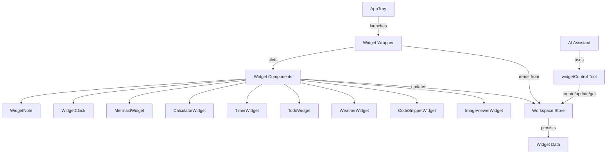
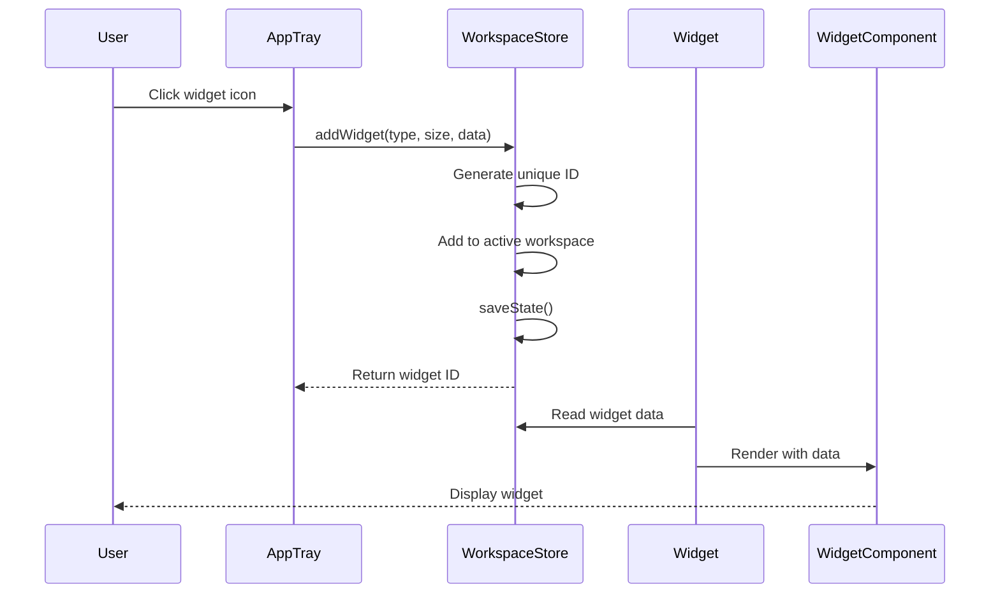
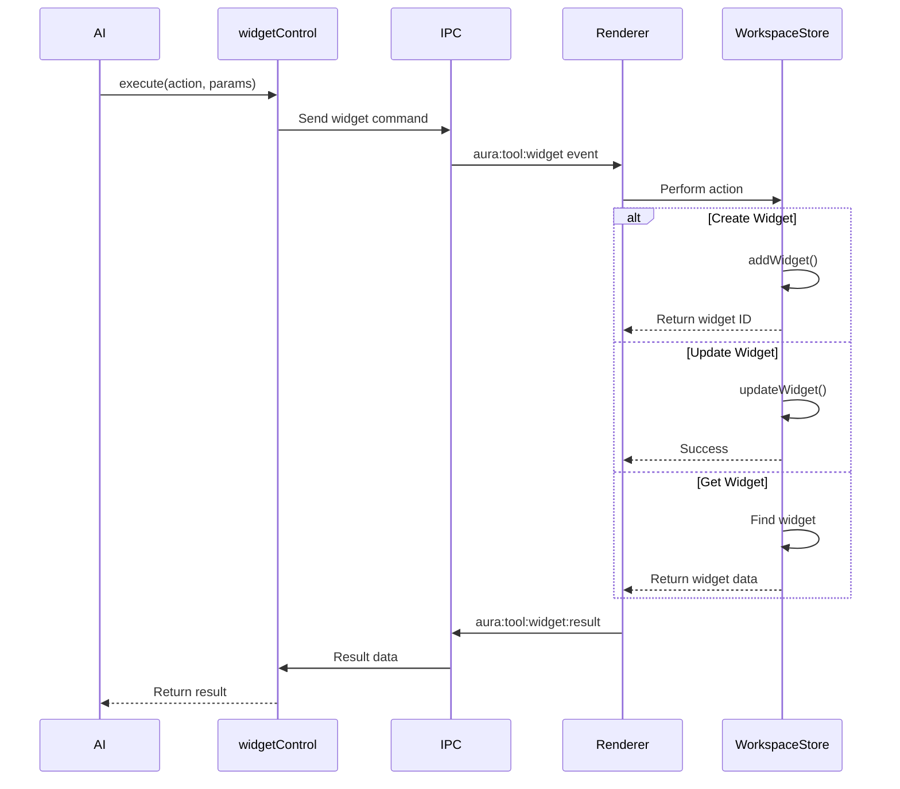
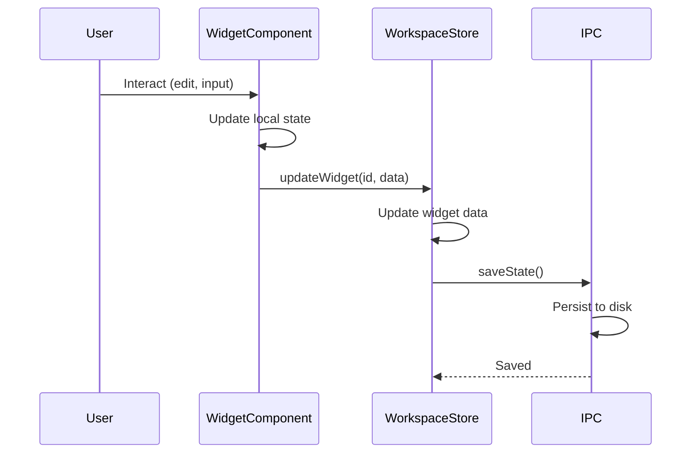

# Design Document: Useful Widgets Expansion

## Overview

This feature expands the existing widget system by adding six new useful widget types (Calculator, Timer/Stopwatch, Todo List, Weather, Code Snippet, and Image Viewer) that integrate seamlessly with the current Widget wrapper component. The expansion includes updating the widgetControl AI tool to support all widget types and enhancing the AppTray with improved visual icons for better user experience.

The design maintains consistency with the existing widget architecture where the Widget wrapper component handles drag/resize functionality while individual widget components manage their own content and state. All widgets follow the established pattern of editable titles, proper padding to avoid handle overlap, and persistent state storage in the workspace store.

## Architecture



## Components and Interfaces

### Widget Wrapper (Existing - No Changes)

**Purpose**: Provides drag and resize functionality for all widgets via slots

**Interface**:

```typescript
interface WidgetWrapperProps {
  id: number
  x: number
  y: number
  w: number
  h: number
  scale: number
  title: string
}

interface WidgetWrapperEmits {
  move: (payload: { id: number; x: number; y: number }) => void
  resize: (payload: { id: number; w: number; h: number }) => void
}
```

**Responsibilities**:

- Handle drag interactions (top-right handle)
- Handle resize interactions (bottom-right handle)
- Emit move/resize events to persist state
- Provide slot for widget content
- Show/hide handles on hover

### CalculatorWidget (New)

**Purpose**: Basic calculator for arithmetic operations

**Interface**:

```typescript
interface CalculatorWidgetProps {
  id: number
  data?: {
    history?: Array<{ expression: string; result: number }>
  }
}

interface CalculatorWidgetData {
  display: string
  currentValue: number
  previousValue: number
  operation: '+' | '-' | '*' | '/' | null
  history: Array<{ expression: string; result: number }>
}
```

**Responsibilities**:

- Display numeric keypad and operation buttons
- Handle arithmetic operations (+, -, \*, /)
- Maintain calculation history
- Support keyboard input
- Clear/reset functionality
- Persist history to workspace store

### TimerWidget (New)

**Purpose**: Countdown timer and stopwatch functionality

**Interface**:

```typescript
interface TimerWidgetProps {
  id: number
  data?: {
    mode?: 'timer' | 'stopwatch'
    timerDuration?: number // seconds
    elapsedTime?: number // seconds
  }
}

interface TimerWidgetData {
  mode: 'timer' | 'stopwatch'
  timerDuration: number
  elapsedTime: number
  isRunning: boolean
  isPaused: boolean
}
```

**Responsibilities**:

- Toggle between timer and stopwatch modes
- Start/pause/reset controls
- Display time in MM:SS format
- Play sound notification when timer completes
- Persist state (mode, duration, elapsed time)
- Handle browser tab visibility (pause when hidden)

### TodoWidget (New)

**Purpose**: Simple todo list with add/complete/delete functionality

**Interface**:

```typescript
interface TodoWidgetProps {
  id: number
  data?: {
    items?: Array<TodoItem>
  }
}

interface TodoItem {
  id: number
  text: string
  completed: boolean
  createdAt: number
}

interface TodoWidgetData {
  items: Array<TodoItem>
  inputValue: string
}
```

**Responsibilities**:

- Add new todo items
- Toggle completion status
- Delete todo items
- Display completed items with strikethrough
- Persist todo list to workspace store
- Auto-focus input on mount

### WeatherWidget (New)

**Purpose**: Display weather information for a specified city

**Interface**:

```typescript
interface WeatherWidgetProps {
  id: number
  data?: {
    city?: string
    weatherData?: WeatherData
    lastUpdated?: number
  }
}

interface WeatherData {
  city: string
  temperature: string
  condition: string
  humidity: string
  note?: string
}

interface WeatherWidgetData {
  city: string
  weatherData: WeatherData | null
  isLoading: boolean
  error: string | null
  lastUpdated: number | null
}
```

**Responsibilities**:

- Input field for city name
- Fetch weather data using getWeather AI tool
- Display temperature, condition, humidity
- Show loading state during fetch
- Display error messages
- Cache weather data with timestamp
- Refresh button to update weather

### CodeSnippetWidget (New)

**Purpose**: Store and display code snippets with syntax highlighting

**Interface**:

```typescript
interface CodeSnippetWidgetProps {
  id: number
  data?: {
    code?: string
    language?: string
  }
}

interface CodeSnippetWidgetData {
  code: string
  language: string
  isEditing: boolean
}
```

**Responsibilities**:

- Editable code textarea
- Language selector dropdown
- Syntax highlighting (using highlight.js or similar)
- Toggle between edit and view modes
- Copy to clipboard button
- Persist code and language selection
- Support common languages (JavaScript, TypeScript, Python, HTML, CSS, JSON, etc.)

### ImageViewerWidget (New)

**Purpose**: Display and manage images from URLs or local files

**Interface**:

```typescript
interface ImageViewerWidgetProps {
  id: number
  data?: {
    imageUrl?: string
    imageName?: string
  }
}

interface ImageViewerWidgetData {
  imageUrl: string | null
  imageName: string | null
  isLoading: boolean
  error: string | null
}
```

**Responsibilities**:

- Input field for image URL
- Display image with proper scaling
- Show loading state
- Handle image load errors
- Display image name/caption
- Fit image within widget bounds
- Support drag-and-drop (future enhancement)

## Data Models

### Widget Store Schema

```typescript
interface Widget {
  id: number
  type:
    | 'note'
    | 'clock'
    | 'mermaid'
    | 'calculator'
    | 'timer'
    | 'todo'
    | 'weather'
    | 'code'
    | 'image'
  x: number
  y: number
  w: number
  h: number
  title?: string
  data?: WidgetTypeData
}

type WidgetTypeData =
  | NoteData
  | ClockData
  | MermaidData
  | CalculatorData
  | TimerData
  | TodoData
  | WeatherData
  | CodeSnippetData
  | ImageViewerData

interface CalculatorData {
  history?: Array<{ expression: string; result: number }>
}

interface TimerData {
  mode?: 'timer' | 'stopwatch'
  timerDuration?: number
  elapsedTime?: number
}

interface TodoData {
  items?: Array<TodoItem>
}

interface WeatherData {
  city?: string
  weatherData?: {
    city: string
    temperature: string
    condition: string
    humidity: string
  }
  lastUpdated?: number
}

interface CodeSnippetData {
  code?: string
  language?: string
}

interface ImageViewerData {
  imageUrl?: string
  imageName?: string
}
```

**Validation Rules**:

- Widget ID must be unique within workspace
- Widget type must be one of the supported types
- Position (x, y) must be numbers
- Size (w, h) must be positive numbers or 0 (auto-size)
- Data must conform to widget type schema

### widgetControl Tool Schema

```typescript
interface WidgetControlInput {
  action: 'create' | 'update' | 'get'
  widgetType?: 'mermaid' | 'calculator' | 'timer' | 'todo' | 'weather' | 'code' | 'image'
  widgetId?: number
  data?: string | object
  title?: string
  position?: {
    x?: number
    y?: number
  }
  size?: {
    w?: number
    h?: number
  }
}

interface WidgetControlOutput {
  success: boolean
  widgetId?: number
  data?: any
  error?: string
}
```

**Validation Rules**:

- action is required
- widgetType is required for 'create' action
- widgetId is required for 'update' and 'get' actions
- data format must match widget type expectations
- position and size values must be valid numbers

## Sequence Diagrams

### Widget Creation Flow



### AI Tool Widget Control Flow



### Widget Update Flow



## AppTray Icon Design

### Current Icons (To Be Updated)

- Note: FileText icon (orange)
- Clock: Clock icon (blue)
- Mermaid: GitBranch icon (purple)

### New Icon Specifications

All icons should:

- Use lucide-vue-next icon library
  d: 'todo', label: 'Todo', icon: CheckSquare, color: '#FFA726' },
  { id: 'weather', label: 'Weather', icon: Cloud, color: '#42A5F5' },
  { id: 'code', label: 'Code', icon: Code, color: '#AB47BC' },
  { id: 'image', label: 'Image', icon: Image, color: '#EC407A' },
  ]

```

**Visual Improvements**:
- Increase icon contrast on hover
- Add subtle scale animation on hover (1.08x)
- Improve button background opacity
- Add tooltip with widget name
- Consider icon badge for widget count (future)

## Error Handling

### Error Scenario 1: Widget Creation Failure

**Condition**: Widget type not supported or invalid parameters
**Response**: Display error message in console, do not create widget
**Recovery**: User can retry with correct parameters

### Error Scenario 2: Widget Data Persistence Failure

**Condition**: IPC communication fails or disk write error
**Response**: Widget continues to function with in-memory state
**Recovery**: Retry persistence on next update, show warning to user

### Error Scenario 3: Weather API Failure

**Condition**: getWeather tool returns error or timeout
**Response**: Display error message in WeatherWidget
**Recovery**: User can retry with refresh button, cached data remains available

### Error Scenario 4: Image Load Failure

**Condition**: Invalid URL or network error
**Response**: Display placeholder with error message
**Recovery**: User can update URL or retry

### Error Scenario 5: widgetControl Tool Timeout

**Condition**: No response from renderer within 5 seconds
**Response**: Return timeout error to AI
**Recovery**: AI can retry operation or inform user

### Error Scenario 6: Invalid Widget ID

**Condition**: Update/get operation with non-existent widget ID
**Response**: Return error indicating widget not found
**Recovery**: AI can query available widgets or create new one

## Testing Strategy

### Unit Testing Approach

**Widget Components**:
- Test component rendering with various prop combinations
- Test user interactions (button clicks, input changes)
- Test state management and updates
- Test data persistence calls to workspace store
- Mock workspace store for isolated testing

**Workspace Store**:
- Test addWidget with all widget types
- Test updateWidget with various data payloads
- Test widget ID generation uniqueness
- Test state persistence and loading
- Test edge cases (empty workspace, invalid IDs)

**widgetControl Tool**:
- Test create action for all widget types
- Test update action with various data formats
- Test get action for existing and non-existent widgets
- Test IPC communication flow
- Test timeout handling
- Mock IPC layer for isolated testing

**AppTray**:
- Test widget launch for all types
- Test icon rendering
- Test hover states and animations

### Property-Based Testing Approach

**Property Test Library**: fast-check (JavaScript/TypeScript)

**Properties to Test**:

1. **Widget ID Uniqueness**: For any sequence of widget creations, all generated IDs must be unique
2. **Widget Position Bounds**: For any widget position update, coordinates must remain valid numbers
3. **Widget Data Integrity**: For any widget update, data structure must match widget type schema
4. **State Persistence Idempotency**: Saving and loading state multiple times produces identical results
5. **Calculator Operations**: For any valid arithmetic expression, result must match JavaScript evaluation
6. **Timer Countdown**: For any timer duration, elapsed time never exceeds duration
7. **Todo Item IDs**: For any sequence of todo additions, all item IDs must be unique

### Integration Testing Approach

**Widget Lifecycle**:
- Test complete flow: AppTray click → widget creation → user interaction → state persistence → app restart → state restoration
- Test widget drag and resize with state persistence
- Test multiple widgets of same type in single workspace

**AI Tool Integration**:
- Test widgetControl tool with real IPC communication
- Test AI creating widgets through tool
- Test AI updating existing widgets
- Test AI retrieving widget data

**Cross-Widget Interactions**:
- Test multiple widgets updating simultaneously
- Test workspace switching with active widgets
- Test widget deletion and cleanup

## Performance Considerations

**Widget Rendering**:
- Use Vue's reactive system efficiently
- Avoid unnecessary re-renders with computed properties
- Lazy load syntax highlighting library for CodeSnippetWidget
- Debounce text input updates (500ms) to reduce store writes

**State Persistence**:
- Debounce high-frequency updates (canvas pan/zoom) at 500ms
- Batch multiple widget updates when possible
- Use IPC efficiently (avoid excessive main-renderer communication)

**Timer Widget**:
- Use requestAnimationFrame for smooth countdown display
- Clear intervals on component unmount
- Pause timers when browser tab is hidden

**Image Widget**:
- Lazy load images
- Use CSS object-fit for proper scaling
- Consider image size limits to prevent memory issues

**Calculator History**:
- Limit history to last 50 calculations
- Implement virtual scrolling if history grows large

## Security Considerations

**Image URLs**:
- Validate URL format before loading
- Use Content Security Policy to restrict image sources
- Sanitize user input for image names

**Code Snippets**:
- Do not execute code, only display
- Sanitize code content before rendering
- Use safe syntax highlighting library

**Weather Data**:
- Validate city name input (prevent injection)
- Use mock data or trusted weather API
- Rate limit weather requests

**Calculator**:
- Sanitize expressions before evaluation
- Use safe math evaluation (no eval with user code)
- Limit expression length and complexity

**widgetControl Tool**:
- Validate all input parameters
- Restrict widget operations to current workspace
- Implement timeout to prevent hanging operations

## Dependencies

**Existing Dependencies**:
- Vue 3 (reactive framework)
- Pinia (state management)
- lucide-vue-next (icons)
- Mermaid (diagram rendering)
- Electron (IPC, main process)

**New Dependencies**:
- highlight.js or Prism.js (syntax highlighting for CodeSnippetWidget)
- No additional dependencies for other widgets (use native browser APIs)

**Optional Future Dependencies**:
- Real weather API integration (OpenWeatherMap, WeatherAPI)
- Image upload/storage service
- Code execution sandbox (for future code runner widget)


## Correctness Properties

*A property is a characteristic or behavior that should hold true across all valid executions of a system—essentially, a formal statement about what the system should do. Properties serve as the bridge between human-readable specifications and machine-verifiable correctness guarantees.*

### Property 1: Calculator arithmetic correctness

*For any* valid arithmetic expression using operations (+, -, *, /), the Calculator_Widget result should match JavaScript's native arithmetic evaluation.

**Validates: Requirements 1.3**

### Property 2: Calculator history persistence round-trip

*For any* calculator history state, persisting to the Workspace_Store then reloading should produce an equivalent history.

**Validates: Requirements 1.6**

### Property 3: Calculator history size invariant

*For any* sequence of calculations, the Calculator_Widget history length should never exceed 50 items.

**Validates: Requirements 1.8, 13.5**

### Property 4: Calculator clear returns to initial state

*For any* calculator state, clicking clear should return the display and calculation state to the initial empty state.

**Validates: Requirements 1.7**

### Property 5: Timer countdown never exceeds duration

*For any* timer duration, the elapsed time during countdown should never exceed the specified duration.

**Validates: Requirements 2.3**

### Property 6: Timer pause preserves time

*For any* running timer or stopwatch, pausing should preserve the current time value without change.

**Validates: Requirements 2.5**

### Property 7: Timer reset returns to initial state

*For any* timer state, clicking reset should return the time to the initial state (zero for stopwatch, duration for timer).

**Validates: Requirements 2.6**

### Property 8: Timer state persistence round-trip

*For any* timer state (mode, duration, elapsed time), persisting to the Workspace_Store then reloading should produce an equivalent state.

**Validates: Requirements 2.9**

### Property 9: Timer format consistency

*For any* time value in seconds, the Timer_Widget display should format it as MM:SS with proper zero-padding.

**Validates: Requirements 2.10**

### Property 10: Todo item ID uniqueness

*For any* sequence of todo item additions, all generated item IDs should be unique within the todo list.

**Validates: Requirements 3.8**

### Property 11: Todo completion toggle idempotence

*For any* todo item, toggling completion status twice should return it to the original completion state.

**Validates: Requirements 3.3**

### Property 12: Todo empty input rejection

*For any* string composed entirely of whitespace characters, attempting to add it as a todo should be rejected and the todo list should remain unchanged.

**Validates: Requirements 3.2**

### Property 13: Todo list persistence round-trip

*For any* todo list state, persisting to the Workspace_Store then reloading should produce an equivalent list with all items and their completion states preserved.

**Validates: Requirements 3.6**

### Property 14: Weather data display completeness

*For any* weather data returned by the getWeather tool, the Weather_Widget display should contain temperature, condition, and humidity fields.

**Validates: Requirements 4.2**

### Property 15: Weather data persistence round-trip

*For any* weather state (city, weather data, timestamp), persisting to the Workspace_Store then reloading should produce an equivalent state.

**Validates: Requirements 4.7**

### Property 16: Code snippet persistence round-trip

*For any* code content and language selection, persisting to the Workspace_Store then reloading should produce equivalent code and language values.

**Validates: Requirements 5.7**

### Property 17: Code snippet syntax highlighting presence

*For any* code content in view mode, the rendered output should contain syntax-highlighted elements based on the selected language.

**Validates: Requirements 5.3**

### Property 18: Code snippet clipboard accuracy

*For any* code content, clicking the copy button should place that exact code content on the clipboard.

**Validates: Requirements 5.6**

### Property 19: Code snippet no execution invariant

*For any* code content entered into the Code_Snippet_Widget, the code should never be executed, only displayed.

**Validates: Requirements 11.4**

### Property 20: Image URL validation

*For any* string input, the Image_Viewer_Widget should only attempt to load strings that match valid URL format.

**Validates: Requirements 6.6, 11.1**

### Property 21: Image viewer persistence round-trip

*For any* image URL and name, persisting to the Workspace_Store then reloading should produce equivalent URL and name values.

**Validates: Requirements 6.5**

### Property 22: Widget ID uniqueness

*For any* sequence of widget creations across all widget types, the Workspace_Store should assign unique IDs to each widget.

**Validates: Requirements 7.1**

### Property 23: Widget data persistence round-trip

*For any* widget of any type and any valid data update, persisting to the Workspace_Store then reloading should produce equivalent widget data.

**Validates: Requirements 7.2, 7.3, 10.6**

### Property 24: Widget type schema validation

*For any* widget data being saved, the Workspace_Store should reject data that does not conform to the widget type's schema.

**Validates: Requirements 7.5**

### Property 25: Workspace store debounce behavior

*For any* sequence of rapid widget updates within a 500ms window, the Workspace_Store should perform at most one persistence operation per window.

**Validates: Requirements 7.6, 13.1**

### Property 26: widgetControl create-get round-trip

*For any* widget type and initial data, creating a widget via widgetControl_Tool then getting it should return equivalent data.

**Validates: Requirements 8.1, 8.3**

### Property 27: widgetControl update-get round-trip

*For any* existing widget and update data, updating via widgetControl_Tool then getting it should return the updated data.

**Validates: Requirements 8.2, 8.3**

### Property 28: widgetControl invalid ID error handling

*For any* non-existent widget ID, update or get operations via widgetControl_Tool should return a "widget not found" error.

**Validates: Requirements 8.6**

### Property 29: widgetControl IPC communication

*For any* widgetControl_Tool action (create, update, get), the tool should communicate with the renderer process via IPC.

**Validates: Requirements 8.7**

### Property 30: widgetControl success response format

*For any* successful widget operation, the widgetControl_Tool should return a response with success status and relevant data.

**Validates: Requirements 8.8**

### Property 31: AppTray icon-type mapping

*For any* widget type, the AppTray should display the correct icon with the correct color as specified in the design.

**Validates: Requirements 9.2, 9.3, 9.4, 9.5, 9.6, 9.7**

### Property 32: AppTray hover scale effect

*For any* widget icon in the AppTray, hovering should apply a 1.08x scale transform.

**Validates: Requirements 9.8**

### Property 33: AppTray hover tooltip display

*For any* widget icon in the AppTray, hovering should display a tooltip containing the widget name.

**Validates: Requirements 9.9**

### Property 34: AppTray click creates widget

*For any* widget icon in the AppTray, clicking should create a new widget of the corresponding type.

**Validates: Requirements 9.10**

### Property 35: Widget wrapper drag and resize functionality

*For any* new widget component rendered in a Widget_Wrapper, the wrapper should provide both drag functionality via the top-right handle and resize functionality via the bottom-right handle.

**Validates: Requirements 10.1, 10.2**

### Property 36: Widget wrapper move event emission

*For any* drag operation on a widget, the Widget_Wrapper should emit move events with coordinates that match the final widget position.

**Validates: Requirements 10.3**

### Property 37: Widget wrapper resize event emission

*For any* resize operation on a widget, the Widget_Wrapper should emit resize events with dimensions that match the final widget size.

**Validates: Requirements 10.4**

### Property 38: Widget wrapper handle visibility

*For any* widget, the Widget_Wrapper should display drag and resize handles only when the user hovers over the widget.

**Validates: Requirements 10.5**

### Property 39: Weather input sanitization

*For any* city name input including malicious injection attempts, the Weather_Widget should sanitize the input before using it.

**Validates: Requirements 11.2**

### Property 40: Code snippet content sanitization

*For any* code content including potential XSS payloads, the Code_Snippet_Widget should sanitize it before rendering.

**Validates: Requirements 11.3**

### Property 41: Calculator expression length limit

*For any* calculator expression input, the Calculator_Widget should reject expressions exceeding the maximum length limit.

**Validates: Requirements 11.6**

### Property 42: widgetControl parameter validation

*For any* widgetControl_Tool invocation, the tool should validate all input parameters and reject invalid parameters before processing.

**Validates: Requirements 11.7**

### Property 43: Widget creation error handling

*For any* widget creation attempt with invalid parameters, the Workspace_Store should not create a widget and should log an error.

**Validates: Requirements 12.1**

### Property 44: Widget persistence failure graceful degradation

*For any* widget when persistence fails, the widget should continue functioning with in-memory state.

**Validates: Requirements 12.2**

### Property 45: Weather tool error display

*For any* error returned by the getWeather tool, the Weather_Widget should display the error message to the user.

**Validates: Requirements 12.3, 4.4**

### Property 46: Image load error display

*For any* image URL that fails to load, the Image_Viewer_Widget should display a placeholder with an error message.

**Validates: Requirements 12.4, 6.3**

### Property 47: widgetControl IPC error handling

*For any* IPC communication failure, the widgetControl_Tool should return an error response to the AI assistant.

**Validates: Requirements 12.5**

### Property 48: Widget component cleanup on unmount

*For any* widget component, unmounting should clear all intervals and event listeners to prevent memory leaks.

**Validates: Requirements 13.3**

### Property 49: Workspace store batch updates

*For any* set of multiple widget updates occurring simultaneously, the Workspace_Store should batch them to reduce IPC calls.

**Validates: Requirements 13.6**
```
