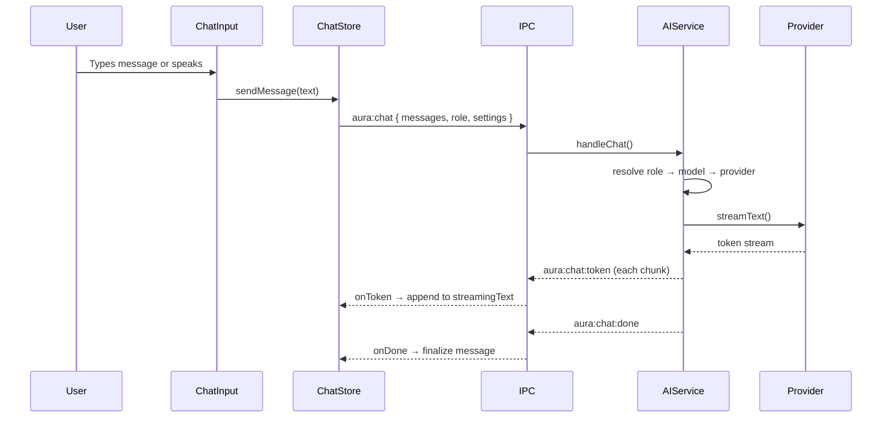

# AI Integration — Walkthrough

## What was built

Full AI integration for Aura OS with **multi-model routing**, **streaming chat**, **voice input**, and **emotion events**.

---

## Files Changed

| File | What |
|---|---|
| [settings.js](file:///Users/vishnu_mac/Desktop/room/exp/aura.os/aura.desktop/src/renderer/src/stores/settings.js) | Added `ai` section: API keys, model registry, role assignments |
| [SettingsAI.vue](file:///Users/vishnu_mac/Desktop/room/exp/aura.os/aura.desktop/src/renderer/src/components/settings/SettingsAI.vue) | **New** — Full settings tab: key inputs, model list CRUD, role dropdowns |
| [SettingsModal.vue](file:///Users/vishnu_mac/Desktop/room/exp/aura.os/aura.desktop/src/renderer/src/components/SettingsModal.vue) | Added "AI" tab with Bot icon |
| [preload/index.js](file:///Users/vishnu_mac/Desktop/room/exp/aura.os/aura.desktop/src/preload/index.js) | Added `auraChat` + `auraStt` IPC channels |
| [ai-service.js](file:///Users/vishnu_mac/Desktop/room/exp/aura.os/aura.desktop/src/main/ai-service.js) | **New** — Provider factory, role→model resolver, streamText, Sarvam STT |
| [main/index.js](file:///Users/vishnu_mac/Desktop/room/exp/aura.os/aura.desktop/src/main/index.js) | Added `aura:chat` + `aura:stt` IPC handlers |
| [chat.js](file:///Users/vishnu_mac/Desktop/room/exp/aura.os/aura.desktop/src/renderer/src/stores/chat.js) | Rewritten: `sendMessage()`, streaming state, emotion parsing |
| [ChatSidebar.vue](file:///Users/vishnu_mac/Desktop/room/exp/aura.os/aura.desktop/src/renderer/src/components/ChatSidebar.vue) | Streaming AI bubble, auto-scroll, real AI wiring |
| [ChatInput.vue](file:///Users/vishnu_mac/Desktop/room/exp/aura.os/aura.desktop/src/renderer/src/components/ChatInput.vue) | Voice button wired to `useVoice` composable |
| [useVoice.js](file:///Users/vishnu_mac/Desktop/room/exp/aura.os/aura.desktop/src/renderer/src/composables/useVoice.js) | **New** — MediaRecorder → base64 → Sarvam STT → transcript |

---

## Data Flow

## How to Use

1. Open **Settings → AI tab**
2. Enter API keys (OpenRouter and/or Google)
3. Add models (e.g. `anthropic/claude-3.5-sonnet` via OpenRouter)
4. Assign models to roles: Chat, Tool Calling, Summarization
5. Start chatting — messages stream in real-time
6. Click the voice button to record → Sarvam transcribes → fills input

## Build Verification

✅ `electron-vite build` — all 3 stages pass (main, preload, renderer)
